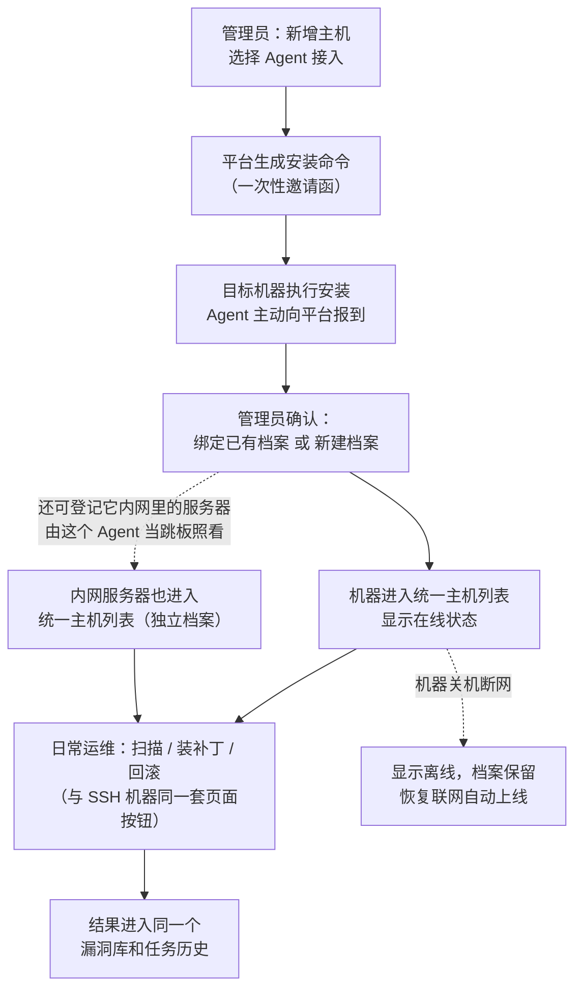

# Agent 融合业务流程说明（通俗版）

> 本文不涉及任何技术实现，面向产品、实施、管理人员，说明"Agent 接入"这件事的来龙去脉和每个业务流程怎么走。

---

## 一、背景：为什么要有 Agent

平台现在管理服务器的方式是 **SSH 直连**：平台知道服务器的 IP 和账号密码，需要干活时（扫漏洞、装补丁）主动连过去操作。

但有一类机器管不了——**桌面电脑 / 办公终端**：

- IP 经常变，今天是这个地址，明天换了；
- 藏在内部网络（NAT / 防火墙）后面，平台根本连不进去；
- 不一定有可以给平台用的账号密码。

解决办法是反过来：**在这类机器上装一个小程序（Agent），让机器主动"打电话"到平台报到并保持在线**。平台有活要派时，不再需要"找上门"，而是等这台机器打进来的电话里"捎话"过去。这样 IP 变不变、有没有防火墙都无所谓了。

**Agent 有两种用法：**

1. **管它自己**：Agent 装在哪台机器上，就直接运维哪台机器（扫描、装补丁都在本机执行）。
2. **当跳板（堡垒机角色）**：有些内网里还有一批服务器，平台够不着，但装了 Agent 的这台机器够得着。这时 Agent 就像一个**驻场联络员**：平台把要做的事告诉 Agent，Agent 再通过内网连到那些目标服务器上去执行，做完把结果带回来。一个 Agent 可以同时照看多台内网服务器。

一句话总结几种方式的区别：

| | SSH 方式（现状） | Agent 管自己 | Agent 当跳板 |
|---|---|---|---|
| 谁主动 | 平台主动连服务器 | 机器主动连平台 | Agent 机器主动连平台，再由它连内网目标 |
| 靠什么找到机器 | 固定 IP + 账号密码 | 机器自己的"身份证号"（client_id） | Agent 的身份证号 + 目标机的内网地址 |
| 适合什么机器 | 机房里的固定服务器 | 桌面电脑、经常换网络的终端 | 平台直接够不着的内网服务器 |

**融合的核心原则：对使用者来说，两种机器看起来、用起来完全一样。** 同一个主机列表、同一套扫描/安装/回滚按钮、同一个任务详情页。区别只是列表里多一列"接入方式"，写着 SSH 还是 Agent。

---

## 二、流程 1：把一台新机器接进来（纳管）

好比给新员工办入职：先开一张有时效的"邀请函"，员工凭邀请函报到，HR 核对身份后正式建档。

**第 1 步：管理员开"邀请函"。**
管理员在平台的"新增主机"里选择"Agent 接入"，平台生成一条**安装命令**（里面含一个一次性凭证，有有效期、有使用次数限制）。

**第 2 步：在目标机器上执行安装。**
把这条命令交给现场人员或用户，在那台电脑上运行，Agent 就装好并自动启动了。

**第 3 步：机器自动报到。**
Agent 启动后主动联系平台，报上自己的信息：机器名、IP、操作系统、自己的身份证号（client_id）。此时平台页面上管理员正处于"等待上线"状态，机器一报到，页面就会显示出这台候选机器。

**第 4 步：管理员确认建档。**
管理员核对信息后二选一：

- 这台机器平台里已经有记录（比如以前用 SSH 管过）→ **绑定到已有档案**；
- 全新的机器 → **创建新档案**。

平台不会自动瞎猜——如果发现这个 IP 对应好几台已有机器、或者这个身份证号已经绑过别的档案，一律停下来让管理员人工确认，绝不自动合并，避免张冠李戴。

**第 5 步：完成。**
绑定成功后自动跳到这台主机的详情页。从此它就和其他机器一样出现在主机列表里，接入方式显示"Agent"。

**异常情况都有兜底**：邀请函过期/用完/被撤销会明确提示重新生成；同一台机器重复报到不会产生两条记录。

---

## 三、流程 1B：通过 Agent 纳管内网服务器（跳板模式）

有些服务器在客户内网深处，平台直接够不着，但网内已经有一台装了 Agent 的机器。这时可以让这台 Agent 机器**兼任堡垒机**，替平台照看这些内网服务器。

**第 1 步：登记内网服务器。**
管理员在平台上正常新增这台内网服务器的档案（填它的内网地址等信息），接入方式选择"通过 Agent 接入"，并指定由哪台已上线的 Agent 机器负责联络它。

**第 2 步：准备通行凭据。**
Agent 连内网服务器走的还是常规登录方式，登录凭据**保存在 Agent 那台机器本地**，不经过平台传输——就像联络员自己拿着钥匙，平台只下达任务、不经手钥匙。

**第 3 步：正常使用。**
之后对这台内网服务器的扫描、装补丁、回滚，操作方式与其他机器完全一样。背后的路径是：平台 → Agent 机器 → 内网服务器，结果原路返回。

**注意事项：**

- 一台 Agent 可以同时照看多台内网服务器；每台内网服务器在平台里都是**独立的档案**，有自己的漏洞数据和任务历史，不会和 Agent 机器本身混在一起。
- Agent 机器离线，等于联络员不在岗——它照看的所有内网服务器都会显示"暂不可执行"，恢复在线后自动恢复。
- Agent 连不上目标服务器（比如目标机关机、钥匙不对），任务会明确报"执行失败"并说明原因，方便区分是"联络员不在"还是"目标机的问题"。

---

## 四、流程 2：日常在线状态

Agent 装好后会**持续和平台保持联系**（类似上班打卡心跳）：

- 一直有联系 → 主机列表显示"**在线**"，所有操作按钮可用；
- 一段时间没联系（比如电脑关机、断网）→ 显示"**离线**"，并保留最后一次在线时间；
- **离线不等于删除**：机器档案、历史漏洞数据、任务记录全部保留，机器再开机联网会自动恢复在线。

按钮的规矩：Agent 离线时，扫描/安装/回滚按钮变灰，提示"Agent 离线，暂不可执行"，而不是点了以后失败。批量操作时如果选中的机器有的能执行有的不能，页面会明确告诉你"多少台可以执行、哪些不行、为什么"，不会悄悄跳过。

---

## 五、流程 3：漏洞扫描

使用者的操作和以前**一模一样**：在主机列表勾选机器，点"扫描"。

背后发生的事（使用者无感知）：

1. 平台创建扫描任务，和以前一样进入任务列表；
2. 平台判断这台机器是哪种接入方式：
   - SSH 机器 → 老路子，平台直连过去扫；
   - Agent 机器 → 平台把扫描指令"捎话"给这台机器的 Agent，由 Agent 在本机执行扫描，再把结果传回平台；
   - 跳板模式的内网服务器 → 指令先到负责它的 Agent，Agent 再连到内网服务器上执行，结果原路带回；
3. 结果回来后，写进**同一个漏洞库**：主机的漏洞数量、严重程度统计、最后扫描时间自动刷新，和 SSH 扫出来的数据放在一起看，没有第二套页面。

任务详情页上能看到这次扫描走的是哪条通道（SSH 还是 Agent），以及完整的进度：排队 → 检查 → 已下发 → 执行中 → 结果回传 → 成功/失败。

---

## 六、流程 4：安装补丁

同样复用现有的补丁安装流程，唯一的体验差别是：**Agent 机器不用填账号密码**（因为不走 SSH 登录）。

1. 在漏洞/补丁页面选择要修复的内容，创建安装任务（该走审批的照走审批）；
2. 平台先做前置检查：机器在不在线、磁盘够不够、依赖全不全、要不要重启；
3. 检查通过后下发执行：SSH 机器直连装，Agent 机器由 Agent 在本机装，跳板模式则由 Agent 连到内网服务器上装；
4. 安装结果（成功/失败、日志）进入原来的任务历史；
5. 装完自动触发一次复扫，漏洞统计随之更新。

如果安装过程中机器断网或重启，任务会标记为"等待恢复"，不会盲目重复安装。

---

## 七、流程 5：回滚（把补丁退回去）

前提规矩：**能不能回滚，由平台在安装时就判断并记录**，不是想回就能回。

1. 安装任务完成后，任务详情里会标明"支持回滚"或"不支持回滚（原因）"；
2. 只有标明支持回滚的任务，才能点"回滚"按钮；
3. 回滚同样走原有的审批和任务流程，结果进入原任务历史；
4. Agent 只是执行回滚动作的通道，回滚的规则和 SSH 机器完全一致。

---

## 八、流程 6：出问题了怎么查（管理员专用）

普通使用者只需要看任务详情里的错误提示，提示会明确区分几种情况：

- **Agent 离线**：那台机器没开机或没联网；
- **通道不可用**：平台内部转发环节故障；
- **任务超时**：机器太久没响应；
- **执行失败**：指令送到了，但机器上执行出错（看日志）；跳板模式下还会说明是 Agent 连不上目标机，还是目标机上执行出了错；
- **结果回传失败**：活干完了，但结果没能正常入库。

管理员额外有一个"**Agent 通道诊断**"入口（从主机详情进入，普通用户看不到），可以查看这台机器的报到记录、心跳、版本和连接日志，用于排查疑难问题。诊断里的"直接下发命令"属于高危功能，需要单独的权限并全程留痕。

---

## 九、权限与安全（一句话版）

- 谁能生成邀请函、谁能绑定机器、谁能发起扫描/安装/回滚、谁能看诊断、谁能下发命令——每一项都是**独立的权限**，由管理员分配；
- 权限是服务端强制的，不是"把按钮藏起来"；
- Agent 与平台之间的通信加密，每台机器的凭证可以随时吊销（比如电脑丢了、员工离职）；
- 所有敏感操作（绑定、解绑、下发命令、回滚）都有审计记录：谁、什么时间、对哪台机器、做了什么、结果如何。

---

## 十、整体一张图

**记住一句话：Agent 给平台多修了一条路——既够得着装了 Agent 的桌面电脑本身，也能借它当跳板够得着它内网里的服务器。路修好之后，车（扫描、补丁、回滚）还是原来的车，站（页面、数据、流程）还是原来的站。**
